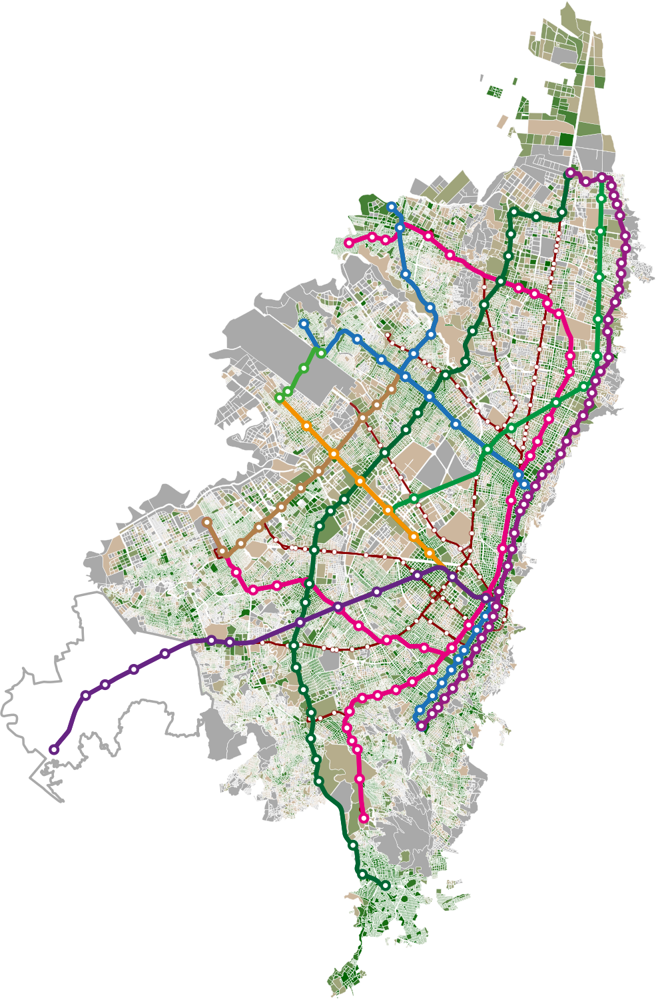

# Transformando la Movilidad Urbana de Bogotá: Implementación e Integración del Sistema de Transporte Masivo Férreo y la Ciudad de Proximidad - Escala de Unidad de Planeación Local (UPL) – 🚈🏙️

# Transforming Urban Mobility in Bogotá: Implementation and Integration of the Rail-Based Mass Transit System and the Proximity City - Local Planning Unit (UPL) Scale – 🚈🏙️

---

> **Repositorio oficial de código para la Tesis de Maestría:**  
> *“Transformando la Movilidad Urbana de Bogotá: Implementación e Integración del Sistema de Transporte Masivo Férreo y la Ciudad de Proximidad – Escala de Unidad de Planeación Local”*  
> **Santiago Silvera Malagon | © 2026**
>
> **Official code repository for the Master’s Thesis:**  
> *“Transforming Urban Mobility in Bogotá: Implementation and Integration of the Rail-Based Mass Transit System and the Proximity City – Local Planning Unit Scale”*  
> **Santiago Silvera Malagon | © 2026**

  

---

## 📄 Descripción | Description

### Español
Este repositorio contiene el flujo de trabajo computacional completo para modelar, simular y evaluar el impacto en la accesibilidad y el **Índice de Alta Calidad de Vida Social (HQSL)** —derivado del concepto de la *Ciudad de los 15 minutos*— como resultado de la implementación de **siete escenarios futuros**, comparados con el estado actual (escenario base) de la ciudad de Bogotá.

### English
This repository contains the complete computational workflow to model, simulate, and assess the impact on accessibility and the **High Quality Social Life Index (HQSL)** —derived from the *15-minute city* concept— resulting from the implementation of **seven future scenarios**, compared against the current situation (baseline scenario) of the city of Bogotá.

---

### Escenarios | Scenarios

| Scenario | Description |
| :--- | :--- |
| **Scenario 1** | Current situation (Baseline) |
| **Scenario 2** | Scenario 1 + Bogotá Metro First Line (PLMB) |
| **Scenario 3** | Scenario 2 + Amenities implementation around PLMB stations |
| **Scenario 4** | Scenario 2 + Full amenities implementation at UPL scale |
| **Scenario 5** | Scenario 1 + Regional Rail Network |
| **Scenario 6** | Scenario 5 + Amenities implementation around rail stations |
| **Scenario 7** | Scenario 5 + Full amenities implementation at UPL scale |

El proyecto utiliza **R** y el motor de enrutamiento **R5 (r5r)** para calcular matrices de tiempos de viaje multimodales y generar el índice **HQSL**.

The project uses **R** and the **R5 routing engine (r5r)** to compute multimodal travel time matrices and generate the **HQSL index**.

---

## 📂 Estructura de Scripts | Scripts Structure

### Español
El código está organizado de forma secuencial para garantizar la reproducibilidad de los resultados:

### English
The code is sequentially organized to ensure full reproducibility of results:

| Script | Description |
| :--- | :--- |
| **`./R/0_Initialization.R`** | Installs / loads required libraries and custom functions |
| **`./R/1_Empty_Shapes.R`** | Cleaning and standardization of spatial data (blocks, UPLs, etc.) |
| **`./R/2_Population.R`** | Census data processing and population density projections |
| **`./R/3_EM2023.R`** | Analysis of the 2023 Mobility Survey (travel patterns, modal split, etc.) |
| **`./R/4_x_Amenities.R`** | Inventory, classification, and georeferencing of urban amenities |
| **`./R/5_0_GTFS_Generator.R`** | **[Key Tool]** Algorithm for generating synthetic GTFS files for projected metro and rail lines |
| **`./R/6_x_Accessibility.R`** | Execution of `r5r` for travel time matrix computation (baseline and future scenarios) |
| **`./R/7_ScoreCard.R`** | HQSL index calculation and diagnostic scorecards (radar charts, maps, etc.) by UPL |
| **`./R/8_Red_Ferrea.R`** | Rail network visualization generation |
| **`./R/9_Misc.R`** | Auxiliary figures and plots |

---

## 📂 Estructura de Carpetas de Datos | Data Folder Structure

Este directorio (`./R/Data/`) almacena los insumos y resultados del proyecto, estructurados según el flujo de trabajo en R.

This directory (`./R/Data/`) stores all project inputs and outputs, structured according to the R workflow.

| Folder | Description | Typical Content |
| :--- | :--- | :--- |
| **`./R/Data/1_Sources/`** | Source data | Surveys (DANE, Mobility), shapefiles, original CSVs |
| **`./R/Data/2_Processing/`** | Intermediate data | `.gpkg`, `.csv`, cleaned tables, spatial joins |
| **`./R/Data/3_Results/`** | Final outputs | Maps (`.png`), charts (`.png`), summary tables |

---

## 📥 Reproducibilidad | Reproducibility Instructions

### Español
Debido al tamaño de los archivos (limitaciones de GitHub), los datos no están alojados directamente en este repositorio. Los archivos fuente se encuentran disponibles en una carpeta externa de Google Drive.

**Para ejecutar el código correctamente:**
1. Descargue los archivos desde el siguiente enlace:  
   👉 **[Acceso a Google Drive](https://drive.google.com/drive/folders/1fvW1JFfZM1tjaLQHEzeKaqh4McILtFRQ?usp=sharing)** *(se requiere solicitar permisos)*.
2. Copie o descomprima los archivos en las carpetas correspondientes (`1_Sources`, `2_Processing`, `3_Results`).
3. Mantenga los nombres originales de los archivos para asegurar la correcta ejecución de los scripts.

### English
Due to file size limitations on GitHub, data files are not hosted directly in this repository. Source data are available via an external Google Drive folder.

**To run the code correctly:**
1. Download the files from the following link:  
   👉 **[Access Google Drive](https://drive.google.com/drive/folders/1fvW1JFfZM1tjaLQHEzeKaqh4McILtFRQ?usp=sharing)** *(permission request required)*.
2. Copy or extract the files into the appropriate folders (`1_Sources`, `2_Processing`, `3_Results`).
3. Keep original file names to ensure script compatibility.

---

## 🛠️ Requisitos e Instalación | Requirements & Installation

- **R**: version 4.4.3  
- **RStudio**: version 2026.01.0  
- **Java Development Kit (JDK 21)** required for R5 routing engine

All required R libraries are automatically installed and loaded via **`0_Initialization.R`**.

---

## 📝 Citación | Citation

If you use this code or methodology, please cite:

Silvera, Santiago (2026). *Transformando la Movilidad Urbana de Bogotá: Implementación e Integración del Sistema de Transporte Masivo Férreo y la Ciudad de Proximidad – Escala de Unidad de Planeación Local*.  
Technische Universität Berlin – Universidad de Buenos Aires.  
GitHub Repository: https://github.com/ssilveram/Tesis_MPMU

---

## 📜 Licencia | License

Este proyecto se distribuye bajo la licencia **CC BY-NC 4.0 (Uso académico y no comercial)**.  
This project is licensed under **CC BY-NC 4.0 (Academic and non-commercial use)**.

See **[LICENSE.md](./LICENSE.md)** for full details.

Desarrollado como parte de la Maestría Dual en Planificación y Movilidad Urbana de la  
**[Technische Universität Berlin](https://www.tu.berlin)** y la **[Universidad de Buenos Aires](https://www.uba.ar)**.
